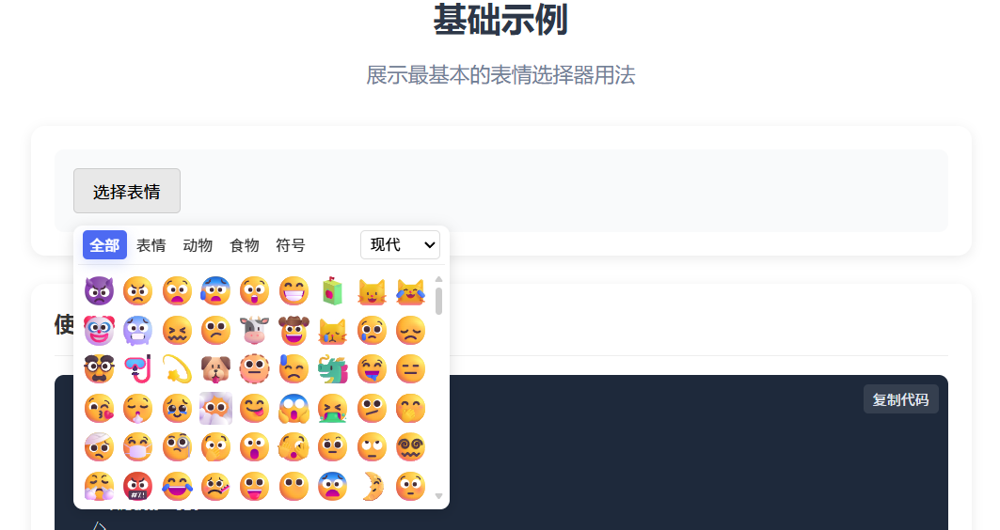
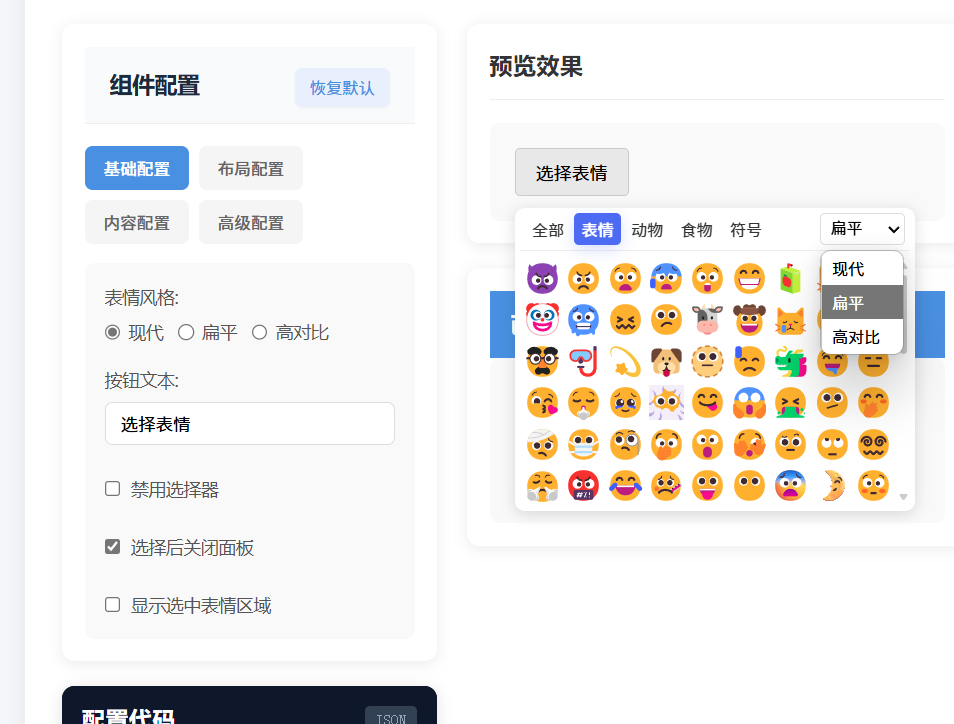

# Fluent Emoji MS

## 关于 Fluent Emoji


Emoji 表情是风靡全球的表情包，通用性很强，包含大量的人物和食物等各种形象，俗称黄豆表情。随着 Windows 11 操作系统的新版本发布，微软对内置的 Emoji 表情进行更新，支持 3D 风格，看上去更加具有立体活泼感。微软宣布开源了这套表情包，让更多的创作者可以使用 `Fluent Emoji`


## fluent-emoji-ms

它是一个Vue 3 组件库，集成了微软 Fluent UI 表情符号，提供易用的表情选择器组件，支持多种风格和丰富的自定义配置。


## 特性

- 🎨 三种表情风格：现代风格 (modern)、扁平风格 (flat) 和高对比度风格 (high-contrast)
- 🔍 内置表情搜索功能
- 📂 按分类浏览表情
- 📱 响应式设计，适配不同屏幕尺寸
- ⚙️ 高度可定制的界面和样式
- 🧩 支持表情分类排序
- 🔄 智能图片加载错误处理
- 💡 轻量级设计，零依赖

## 示例

- https://igeekfan.github.io/fluent-emoji-ms/





## 安装

```bash
# npm
npm install fluent-emoji-ms

# yarn
yarn add fluent-emoji-ms

# pnpm
pnpm add fluent-emoji-ms
```

## 快速开始

### 导入和注册

```js
// 方式1：直接导入组件
import { FluentEmojiPicker } from 'fluent-emoji-ms'
import 'fluent-emoji-ms/style.css'  // 别忘记导入样式！

// 方式2：全局注册
import { FluentEmojiPicker } from 'fluent-emoji-ms'
import 'fluent-emoji-ms/style.css'

const app = createApp(App)
app.use(FluentEmojiMS)
app.mount('#app')
```

### 基本使用

```vue
<template>
  <div>
    <FluentEmojiPicker @select="handleSelectEmoji" />
    
    <div v-if="selectedEmoji" class="selected-emoji-info">
      
      <span>{{ selectedEmoji.name }}</span>
    </div>
  </div>
</template>

<script setup>
import { ref } from 'vue'
import { FluentEmojiPicker } from 'fluent-emoji-ms'
import 'fluent-emoji-ms/style.css'

const selectedEmoji = ref(null)

function handleSelectEmoji(emoji) {
  selectedEmoji.value = emoji
  console.log('Selected emoji:', emoji)
  // emoji 对象包含: { name, category, path, style }
}
</script>
```

## 配置选项

### 表情风格

支持三种不同的表情风格，可以通过 `initialStyle` 属性设置默认风格:

```vue
<template>
  <!-- 设置默认为扁平风格 -->
  <FluentEmojiPicker initialStyle="flat" @select="handleSelectEmoji" />
</template>
```

可选风格:
- `"modern"` - 现代风格（默认）
- `"flat"` - 扁平风格
- `"high-contrast"` - 高对比度风格

### 自定义按钮

```vue
<template>
  <!-- 自定义按钮文本 -->
  <FluentEmojiPicker buttonText="插入表情" />

  <!-- 使用插槽自定义按钮 -->
  <FluentEmojiPicker @select="handleSelectEmoji">
    <button class="custom-button">😊 选择表情</button>
  </FluentEmojiPicker>
</template>
```

### 完整配置示例

```vue
<template>
  <FluentEmojiPicker 
    :disabled="false"
    initialStyle="modern"
    defaultCategory="all"
    buttonText="选择表情"
    :baseUrl="cdnUrl"
    :width="320"
    :columns="6"
    :categories="['smileys', 'people-body', 'animals-nature']"
    :closeOnSelect="true"
    :showSelectedEmoji="true"
    :autoFill="true"
    :emojiSize="28"
    @select="handleSelectEmoji"
    @clear="handleClear"
  />
</template>

<script setup>
const cdnUrl = 'https://cdn.jsdelivr.net/npm/fluentui-emoji@1.1.1'
</script>
```

## API 参考

### FluentEmojiPicker

#### Props

| 属性名 | 类型 | 默认值 | 描述 |
|--------|------|--------|------|
| disabled | Boolean | false | 是否禁用选择器 |
| initialStyle | String | 'modern' | 初始表情风格 ('modern'/'flat'/'high-contrast') |
| defaultCategory | String | 'all' | 默认选中的表情分类 |
| buttonText | String | '选择表情' | 按钮显示的文本 |
| baseUrl | String | 'https://cdn.jsdelivr.net/npm/fluentui-emoji@1.1.1' | 表情图标基础 URL |
| width | Number/String | 320 | 选择器弹出框宽度 |
| columns | Number | 6 | 固定列数 (仅当autoFill=false时生效) |
| categories | Array | [...] | 要显示的表情分类 |
| closeOnSelect | Boolean | true | 选择表情后是否关闭面板 |
| showSelectedEmoji | Boolean | false | 是否显示选中的表情信息区域 |
| autoFill | Boolean | true | 是否自动填充表情网格 |
| emojiSize | Number | 28 | 表情图标大小(像素) |

#### Events

| 事件名 | 参数 | 描述 |
|--------|------|------|
| select | emojiWithStyle | 选中表情时触发，返回带样式的表情对象 |
| clear | - | 清除选中表情时触发 |

#### 表情对象结构

选中表情时返回的对象格式：

```ts
interface EmojiItemWithStyle {
  name: string;       // 表情名称
  category: string;   // 分类
  path: string;       // 图片路径 (SVG 文件相对路径)
  style: string;      // 风格 ('modern'/'flat'/'high-contrast')
}
```

## 样式定制

### 使用 CSS 变量

组件使用了以下 CSS 变量，可以通过覆盖它们来自定义样式：

```css
:root {
  --emoji-picker-bg: white;
  --emoji-picker-border: 1px solid #eee;
  --emoji-picker-radius: 8px;
  --emoji-picker-shadow: 0 2px 10px rgba(0, 0, 0, 0.1);
  
  --emoji-item-hover-bg: rgba(0, 0, 0, 0.05);
  --emoji-active-color: #4d6af2;
  
  --emoji-button-bg: #f0f0f0;
  --emoji-button-border: 1px solid #ccc;
  --emoji-button-hover-bg: #e0e0e0;
}
```

### 自定义样式示例

```vue
<template>
  <div class="dark-theme">
    <FluentEmojiPicker @select="handleSelectEmoji" />
  </div>
</template>

<style>
.dark-theme {
  --emoji-picker-bg: #2a2a2a;
  --emoji-picker-border: 1px solid #444;
  --emoji-picker-shadow: 0 2px 10px rgba(0, 0, 0, 0.3);
  --emoji-item-hover-bg: rgba(255, 255, 255, 0.1);
  --emoji-active-color: #7b96ff;
  --emoji-button-bg: #3a3a3a;
  --emoji-button-border: 1px solid #555;
  --emoji-button-hover-bg: #4a4a4a;
  
  /* 添加额外的样式覆盖 */
  --emoji-text-color: #eee;
}

.dark-theme .emoji-picker-button {
  color: #eee;
}

.dark-theme .tab-button {
  color: #ddd;
}
</style>
```

## 使用自定义 CDN 或本地图片

默认情况下，组件使用 jsdelivr CDN 加载表情图标。您可以通过设置 `baseUrl` 属性来使用其他 CDN 或本地图片：

```vue
<template>
  <!-- 使用自定义CDN -->
  <FluentEmojiPicker baseUrl="https://your-cdn.com/emoji-assets" />
  
  <!-- 使用本地图片 -->
  <FluentEmojiPicker baseUrl="/assets/emojis" />
</template>
```

图标目录结构需要符合以下格式：

```
/icons
  /modern
    /smiling-face.svg
    /...
  /flat
    /smiling-face.svg
    /...
  /high-contrast
    /smiling-face.svg
    /...
```

## 可用的 CDN 资源

- jsDelivr: `https://cdn.jsdelivr.net/npm/fluentui-emoji@1.1.1`
- UNPKG: `https://unpkg.com/fluentui-emoji@1.1.1`

示例 URL:
- `https://cdn.jsdelivr.net/npm/fluentui-emoji@1.1.1/icons/flat/smiling-face-with-hearts.svg`

## 常见问题解答

### 表情图片无法加载

1. 确保您的网络可以访问配置的 CDN
2. 如果遇到跨域问题，可以下载表情图标到本地使用
3. 组件内置了图片加载失败处理，会自动尝试其他风格的图标

### 自定义表情大小

通过 `emojiSize` 属性调整表情大小：

```vue
<FluentEmojiPicker :emojiSize="36" />
```

## 浏览器兼容性

- 支持所有现代浏览器
- IE11 需要相应的 polyfills

## 示例

访问[示例页面](https://igeekfan.github.io/fluent-emoji-ms/)查看更多使用示例。

## 许可证

MIT