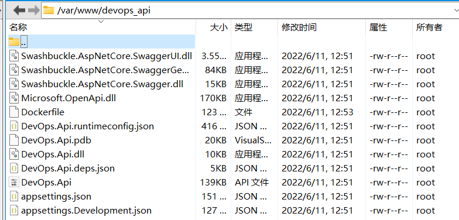

# ASP.NET Core+Docker+AliYun  部署

## ASP.NET Core+Docker 部署

- ubuntu 安装了docker
- 本地.net sdk
- 工具:xshell、xftp
- 开通阿里的[容器镜像服务 (aliyun.com)](https://cr.console.aliyun.com/cn-hangzhou/instances)：用于私有镜像上传

## 部署分为几种方式

- 本地生成aspnetcore的发布包，在服务器上生成docker镜像，直接在服务器运行
- 本地构建Docker镜像，推送Aliyun容器镜像，服务器拉取镜像并运行
- Jenkins、Aliyun容器镜像、自动化脚本（跨服务器）

## 方式1.本地生成部署包+服务器Docker 部署

1.本地如果没有安装Docker for Windows，可在服务器，如ubuntu安装了Docker

[Install Docker Engine on Ubuntu | Docker Documentation](https://docs.docker.com/engine/install/ubuntu/)

本地创建一个ASP.NET Core项目`DevOps.Api`，项目源码已上传至github

[luoyunchong/devops: Azure DevOps Pipelines Release Aliyun 阿里云 Docker CI/CD 持续集成 (github.com)](https://github.com/luoyunchong/devops)

创建配置Dockerfile文件，替换如下内容，右键属性配置，复制到输出目录：如果较新则复制

```docker
FROM mcr.microsoft.com/dotnet/aspnet:7.0 AS base
COPY . /app
WORKDIR /app
EXPOSE 80
ENTRYPOINT ["dotnet", "DevOps.Api.dll"]
```

生成.NET项目包

```bash
cd e:/code/devops/DevOps.Api
dotnet publish --configuration Release
```

将在此目录生成部署的文件

```bash
e:/code/devops/DevOps.Api/bin/Release/net7.0/publish
```

在ubuntu创建一个目录 devops_api，将生成文件内容，使用xftp上传至ubuntu文件夹中

```bash
mkdir /var/www/devops_api -p
cd /var/www/devops_api
```



### Docker打包

ubuntu上安装好了docker，并且正常运行。

```bash
cd /var/www/devops_api # 先cd的项目目录 
docker build -t igeekfan/devops_api .     #生成images
docker run -d -p 7007:80 igeekfan/devops_api   # 生成 container 并运行在5000端口
```

- **d** 代表后台运行
- p 此时将对外显露7007端口运行，7007是运行后，docker对外的端口，80是这个服务对外的端口，其中Dockerfile 存在语句EXPOSE 80

此时打开 浏览器， ip+端口7007即可访问服务。

<http://127.0.0.1:7007/swagger/index.html>

## 方式二.Docker 打包并部署

- 此方法必须在本地安装docker

### 创建Dockerfile时

直接使用默认创建的文件内容即可，不需要修改任何内容

```docker
#See https://aka.ms/containerfastmode to understand how Visual Studio uses this Dockerfile to build your images for faster debugging.

FROM mcr.microsoft.com/dotnet/aspnet:7.0 AS base
WORKDIR /app
EXPOSE 80
EXPOSE 443

FROM mcr.microsoft.com/dotnet/sdk:7.0 AS build
WORKDIR /src
COPY ["DevOps.Api/DevOps.Api.csproj", "DevOps.Api/"]
RUN dotnet restore "DevOps.Api/DevOps.Api.csproj"
COPY . .
WORKDIR "/src/DevOps.Api"
RUN dotnet build "DevOps.Api.csproj" -c Release -o /app/build

FROM build AS publish
RUN dotnet publish "DevOps.Api.csproj" -c Release -o /app/publish /p:UseAppHost=false

FROM base AS final
WORKDIR /app
COPY --from=publish /app/publish .
ENTRYPOINT ["dotnet", "DevOps.Api.dll"]
```

### 上传至阿里云

先登录

```bash
#登录
sudo docker login --username=[账号] registry.cn-hangzhou.aliyuncs.com
#密码
#输入密码 xxxxx

#或使用此命令

echo [密码]| sudo docker login --username=[账号] registry.cn-hangzhou.aliyuncs.com --password-stdin
```

打包并推到阿里云镜像

```bash
#进入项目根目录
cd e:/code/devops
#build 镜像
docker build -f DevOps.Api/Dockerfile  -t devops_api .
#打包tag
docker tag devops_api registry.cn-hangzhou.aliyuncs.com/igeekfan/devops_api
#推送阿里云
docker push registry.cn-hangzhou.aliyuncs.com/igeekfan/devops_api
```

### 启动服务

(服务器上必须安装docker、在linux服务器上执行)

### 登录阿里容器镜像

```bash
echo [密码]| sudo docker login --username=[账号] registry.cn-hangzhou.aliyuncs.com --password-stdin
```

### 判断是否存在容器（镜像），如果存在则删除

```bash
#判断是否存在-devops_api容器
docker ps | grep devops_api &> /dev/null
#如果不存在，则Remove
if [ $? -ne 0 ]
then
    echo "devops_api container not exist continue.. "
else
    echo "remove devops_api container"
    docker rm devops_api -f
fi

docker images | grep registry.cn-hangzhou.aliyuncs.com/igeekfan/devops_api &> /dev/null
#如果不存在，不做操作
if [ $? -ne 0 ]
then
    echo "image does not exist , continue..."
else
    echo "image exists !!! remove it"
    docker rmi --force registry.cn-hangzhou.aliyuncs.com/igeekfan/devops_api
fi
```

### 拉取镜像

```bash
docker pull registry.cn-hangzhou.aliyuncs.com/igeekfan/devops_api:latest
```

### 方式1.直接启动

```bash
docker run --restart unless-stopped -p 5015:80  --privileged=true --name 
devops_api -d registry.cn-hangzhou.aliyuncs.com/igeekfan/devops_api
```

### 方式2.使用映射目录启动

```bash
mkdir -p /var/www/devops_api/wwwroot
docker run --restart unless-stopped -p 5014:80 \
-v /var/www/devops_api/wwwroot:/app/wwwroot:rw \
-v /var/www/devops_api/appsettings.json:/app/appsettings.json \
--privileged=true \
--name devops_api \
-d registry.cn-hangzhou.aliyuncs.com/igeekfan/devops_api
```

## 源码

[luoyunchong/devops: Azure DevOps Pipelines Release Aliyun 阿里云 Docker CI/CD 持续集成 (github.com)](https://github.com/luoyunchong/devops)

## 参考

[ASP.NET Core开发Docker部署](https://www.cnblogs.com/zxtceq/p/7403953.html)
