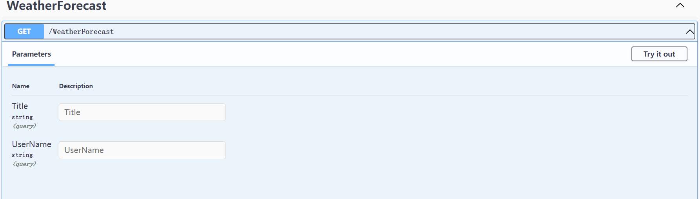
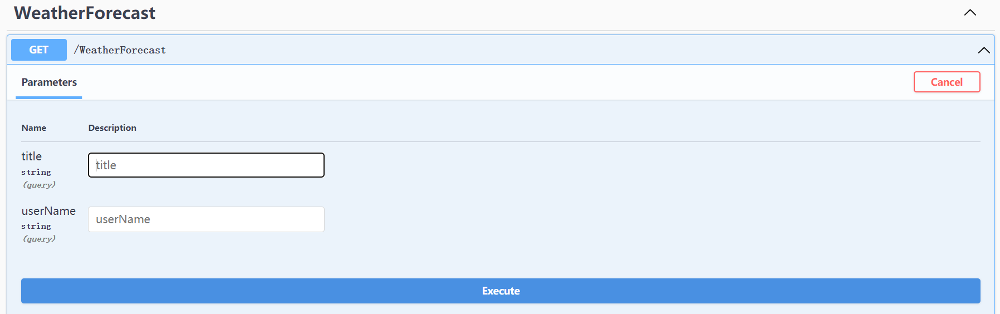

# Extras 扩展包

该项目是基于 FreeSql 实现的一些扩展包、AOP 事务，当前用户，简化依赖注入

- IGeekFan.FreeKit.Extras的依赖项

```xml
<PackageReference Include="FreeSql.DbContext" Version="3.2.664" />
<PackageReference Include="Autofac.Extensions.DependencyInjection" Version="8.0.0" />
<PackageReference Include="Autofac.Extras.DynamicProxy" Version="6.0.1" />
<PackageReference Include="Castle.Core.AsyncInterceptor" Version="2.1.0" />
```

根据自己访问数据库的不同，安装对应的[Provider](http://freesql.net/guide/install.html#packages)

```bash
dotnet add package IGeekFan.FreeKit.Extras
dotnet add package FreeSql.Provider.Sqlite
```

## 一些扩展包

- 简化 FreeSql 单库的配置：UseConnectionString 扩展方法
- 基于特性标签的 AOP 事务
- 基于接口的注入
- 通用 CRUD 的
- Security 当前登录人信息
- FluentAPI 基于接口的配置实体
- 注入以 Service 为后缀接口所在的程序集
- CaseQuery 支持 Get 请求参数 key，大小驼峰转换

### 简化 FreeSql 单库的配置

UseConnectionString 扩展方法，DefaultDB 配置 0 代表使用配置串 MySql。需要安装`FreeSql.Provider.MySqlConnector`,`DefaultDB`配置的值实际为`FreeSql.DataType`的枚举值

- appsettings.json

```json
"ConnectionStrings": {
    "DefaultDB": "0",
    "DataType": {
        "MySql": 0,
        "SqlServer": 1,
        "PostgreSQL": 2,
        "Oracle": 3,
        "Sqlite": 4
     },
    "MySql": "Data Source=localhost;Port=3306;User ID=root;Password=root;Initial Catalog=freekit;Charset=utf8mb4;SslMode=none;Max pool size=1;Connection LifeTime=20",
    "SqlServer": "Data Source=.;User ID=sa;Password=123456;Integrated Security=True;Initial Catalog=LinCMS;Pooling=true;Min Pool Size=1",
    "PostgreSQL": "Host=localhost;Port=5432;Username=postgres;Password=123456; Database=lincms;Pooling=true;Minimum Pool Size=1",
    "Oracle": "user id=user1;password=123456; data source=//127.0.0.1:1521/ORCL;Pooling=true;Min Pool Size=1",
    "Sqlite": "Data Source=|DataDirectory|\\freekit.db; Attachs=freekit.db; Pooling=true;Min Pool Size=1"
    }
```

```csharp
    public static IServiceCollection AddFreeSql(this IServiceCollection services, IConfiguration configuration)
    {
        IFreeSql fsql = new FreeSqlBuilder()
                  .UseConnectionString(configuration)
                  .UseNameConvert(NameConvertType.PascalCaseToUnderscoreWithLower)
                  .UseAutoSyncStructure(true) //自动同步实体结构到数据库，FreeSql不会扫描程序集，只有CRUD时才会生成表。
                  .UseMonitorCommand(cmd =>
                  {
                      Trace.WriteLine(cmd.CommandText + ";");
                  })
                  .Build();

        fsql.GlobalFilter.Apply<ISoftDelete>("IsDeleted", a => a.IsDeleted == false);

        services.AddSingleton<IFreeSql>(fsql);
        services.AddFreeRepository();
        services.AddScoped<UnitOfWorkManager>();

        return services;
    }
```


### 基于特性标签的 AOP 事务

- 特性标签 **[Transactional]**

通过 Autofac 配置哪些类需要基于特性标签的 AOP 事务

```csharp
public interface IGroupService
{
    Task DeleteAsync(long id);
}
public class GroupService : IGroupService
{
    private readonly IBaseRepository<LinGroup, long> _groupRepository;
    private readonly IBaseRepository<LinGroupPermission, long> _groupPermissionRepository;

    public GroupService(IBaseRepository<LinGroup, long> groupRepository,IBaseRepository<LinGroupPermission, long> groupPermissionRepository)
    {
        _groupRepository = groupRepository;
        _groupPermissionRepository = groupPermissionRepository;
    }
    /// <summary>
    /// 删除group拥有的权限、删除group表的数据
    /// </summary>
    /// <param name="id"></param>
    /// <returns></returns>
    [Transactional]
    public async Task DeleteAsync(long id)
    {
        await _groupRepository.DeleteAsync(id);
        await _groupPermissionRepository.DeleteAsync(r => r.GroupId == id);
    }
}
```

如果依旧是 Startup 的模式，可通过 ConfigureContainer 配置服务，其中`ServiceModule`是一个Autofac的Module，此外为Demo

- Program.cs 配置

```csharp
    Host.CreateDefaultBuilder(args)
                .UseServiceProviderFactory(new AutofacServiceProviderFactory())
                .ConfigureWebHostDefaults(webBuilder =>
                {
                    webBuilder.UseStartup<Startup>();
                });
```

- Startup.cs 配置

```csharp
    public void ConfigureContainer(ContainerBuilder builder)
    {
        builder.RegisterModule(new ServiceModule());
    }
```

ASP.NET Core6配置服务、

```csharp
builder.Host
    .UseServiceProviderFactory(new AutofacServiceProviderFactory())
    .ConfigureContainer<ContainerBuilder>((webBuilder, containerBuilder) =>
    {
        containerBuilder.RegisterModule(new ServiceModule());
    });
```

### 基于接口的注入

只需要继承如下接口，会自动按照对应的生命周期注入到 DI 中。

- IScopedDependency 范围
- ISingletonDependency 单例
- ITransientDependency 瞬时

```csharp
namespace Module1
{
    public interface ITestService : ITransientDependency
    {
        bool ExecuteConnectTest();
    }
}

namespace Module1
{
    public class TestService : ITestService
    {
        private readonly IFreeSql _fsql;
        public TestService(IFreeSql fsql)
        {
            _fsql = fsql;
        }

        public bool ExecuteConnectTest()
        {
            return _fsql.Ado.ExecuteConnectTest();
        }
    }
}

public class TestController : Controller
{
    ILogger<TestController> logger;
    private readonly ITestService testService;

    public TestController(ILogger<TestController> logger, ITestService testService)
    {
        this.logger = logger;
        this.testService = testService;
    }

    [HttpGet("ExecuteConnectTest")]
    public ActionResult<bool> ExecuteConnectTest()
    {
        return testService.ExecuteConnectTest();
    }
}

```

1.获取所有的程序集合，然后根据 FullName，一般为项目名，过滤具体的程序集

```csharp
builder.Host
    .UseServiceProviderFactory(new AutofacServiceProviderFactory())
    .ConfigureContainer<ContainerBuilder>((webBuilder, containerBuilder) =>
    {
        Assembly[] currentAssemblies = AppDomain.CurrentDomain.GetAssemblies().Where(r =>
r.FullName.Contains("IGeekFan.FreeKit.Extras")||
r.FullName.Contains("Module1")
).ToArray();

        containerBuilder.RegisterModule(new FreeKitModule(currentAssemblies));
    });
```

其中`FreeKitModule`的参数支持`params Type[]types`或`params Assembly[]assemblies`,即哪些[程序集](https://docs.microsoft.com/zh-cn/dotnet/standard/assembly/)中的类需要注入到依赖注入的集合中。

2.根据程序集中的某个类获取程序集

```csharp
Assembly[] currentAssemblies2 = new Assembly[] { typeof(FreeKitModule).Assembly, typeof(Module1.Module1Startup).Assembly };
containerBuilder.RegisterModule(new FreeKitModule(currentAssemblies2));
```

3.直接使用 params Assembly[] 的特性，直接作为 FreeKitModule 的参数

```csharp
containerBuilder.RegisterModule(new FreeKitModule( typeof(FreeKitModule).Assembly, typeof(Program).Assembly))
```

4，通过 params Type[]，内部解析 Assembly。

```csharp
containerBuilder.RegisterModule(new FreeKitModule(typeof(FreeKitModule), typeof(Program)))
```

其中，此程序集中的类 如果继承了`IScopedDependency`,`ISingletonDependency`、`ITransientDependency`这些接口， 都会按照对应的生命周期注入到依赖注入的集合中 ，可直接使用。

### CurrentUser 当前登录人信息

如何使用，先注入`IHttpContextAccessor`

```csharp
    services.AddHttpContextAccessor();
```

因为我们无法确定用户 Id 的类型，可能是`long`,也可能是`Guid`，ICurrentUser\<T\>是泛型的，默认有一个实现`ICurrentUser:ICurrentUser<string>`,所以通过 `ICurrentUser`，默认Id为string?类型，如果想改变类型，可使用`ICurrentUser`接口`FindUserIdToLong`扩展方法，获取`long?`类型的用户`Id`,或使用`ICurrentUser`接口`FindUserIdToGuid`的扩展方法

此接口定义如下继承了`ITransientDependency`,所以他是瞬时

```csharp
public interface ICurrentUser<T> : ITransientDependency
{
    /// <summary>
    /// 是否登录
    /// </summary>
    bool IsAuthenticated { get; }

    /// <summary>
    /// 用户Id
    /// </summary>
    T? Id { get; }

    /// <summary>
    /// 登录名，用户名，唯一值
    /// </summary>
    string UserName { get; }

    /// <summary>
    /// 昵称
    /// </summary>
    string? NickName { get; }

    /// <summary>
    /// 邮件
    /// </summary>
    string? Email { get; }

    /// <summary>
    /// 角色
    /// </summary>
    string[] Roles { get; }

    Claim FindClaim(string claimType);

    Claim[] FindClaims(string claimType);

    Claim[] GetAllClaims();

    bool IsInRole(string roleId);
}
```

当然可增加一个扩展方法，用于不确定主键类型,所有的方法都调用此方法，需要更改类型，则只用更改此方法即可,比如如果用户Id类型是int类型，可自行创建此扩展类进行处理

```csharp
public static class Extensions
｛
    public static int? FindUserId(this ICurrentUser currentUser)
    {
        if (currentUser.Id == null) return null;
        return int.Parse(currentUser.Id);
    }
}
```


### 实体审计类

- FullAduitEntity

### CaseQuery 支持 Get 请求参数 key，大小驼峰转换

`HttpGet`请求时，参数的 key 和实体相同，比如创建如下类。

```csharp
public class QueryModel
{
    public string Title { get; set; }
    public string UserName { get; set; }
}
```

```csharp
[HttpGet]
public IEnumerable<WeatherForecast> Get([FromQuery] QueryModel queryModel)
{
    return null;
}
```

在 swagger 下就会生成如下内容


如果实现，GET 请求参数的 key 转换呢。

### 查询参数转换支持

- SnakeCase（下划线写法）
- LowerCase（小写）
- CamelCase（首字母小写）

- 使用方式

在 AddControllers 中注入实现

```csharp
    services.AddControllers(options =>
    {
        options.ValueProviderFactories.Add(new CamelCaseValueProviderFactory());
    });
```

swagger 渲染需要替换 provider

```csharp
    services.TryAddEnumerable(ServiceDescriptor.Transient<IApiDescriptionProvider, CamelCaseApiDescriptionProvider>());
```



其中支持的 Factory 如下

- SnakeCaseValueProviderFactory（下划线写法）
- LowerCaseValueProviderFactory（小写）
- CamelCaseValueProviderFactory（首字母小写）

Provider 支持如下

- SnakeApiDescriptionProvider（下划线写法）
- LowerApiDescriptionProvider（小写）
- CamelCaseApiDescriptionProvider（首字母小写）
